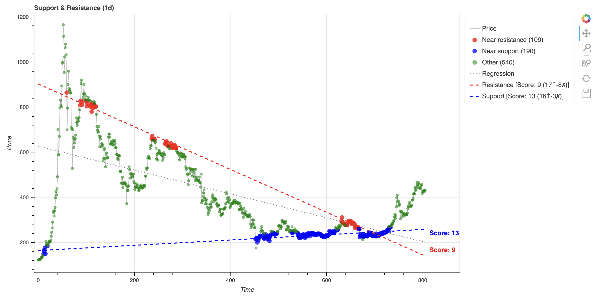
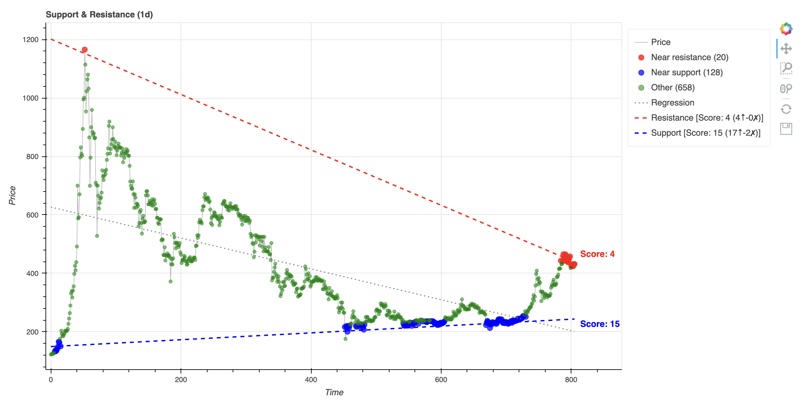

# Rulers: Support & Resistance Line Detection

This document explains the algorithm for finding optimal **topline (resistance)** and **bottomline (support)** lines for price data.

## Quick Start

```bash
# Basic usage
python -m brokrest ruler data/xbtusd_ohlc_sample.csv

# With matplotlib backend
python -m brokrest ruler data/xbtusd_ohlc_sample.csv --backend mpl

# Tolerance mode (capture more points in band)
python -m brokrest ruler data/xbtusd_ohlc_sample.csv --tolerance

# Parallel lines (no rotation)
python -m brokrest ruler data/xbtusd_ohlc_sample.csv --no-rotate
```

---

## Algorithm Overview

The algorithm finds two bounding lines for price data:
- **Topline (Resistance)**: A line above all data points, as close as possible
- **Bottomline (Support)**: A line below all data points, as close as possible

### Step-by-Step Process

#### Step 1: Linear Regression Baseline

Start with a standard linear regression line through all data points:

```
y = m_base * x + b_base
```

This gives us the "natural" slope of the data.

#### Step 2: Shift to Contact

**For Topline:**
- Shift the line **up** until all points are below or touching the line
- The shift amount is `δ = max(y_i - pred_i)` for all points

**For Bottomline:**
- Shift the line **down** until all points are above or touching the line  
- The shift amount is `δ = min(y_i - pred_i)` for all points

After shifting, at least one point will be **touching** the line (contact point).

#### Step 3: Pivot and Optimize Slope

Using the contact point as a **pivot**, we rotate the line to minimize MSE while respecting constraints.

**The optimization problem:**
```
minimize:    MSE = mean((y_i - pred_i)²)
subject to:  All points on correct side of line
```

**Key insight:** The line passes through the pivot point, so:
```
y = m * (x - pivot_x) + pivot_y
```

We transform to pivot-centered coordinates:
```
dx_i = x_i - pivot_x
dy_i = y_i - pivot_y
```

**Constraint derivation (for topline):**
- Points to the **right** of pivot (`dx > 0`): slope must be steep enough → `m ≥ dy_i/dx_i`
- Points to the **left** of pivot (`dx < 0`): slope must not be too steep → `m ≤ dy_i/dx_i`

This gives us bounds: `m_lower ≤ m ≤ m_upper`

#### Step 4: Analytic Solution

The unconstrained optimal slope (minimizing MSE) has a **closed-form solution**:

```
m_opt = mean(dx * dy) / mean(dx²)
```

This is derived by setting `d(MSE)/dm = 0`:

```
MSE(m) = mean((dy - m*dx)²)
      = mean(dy² - 2m*dx*dy + m²*dx²)

d(MSE)/dm = -2*mean(dx*dy) + 2m*mean(dx²) = 0

∴ m = mean(dx*dy) / mean(dx²)
```

**Final step:** Clamp to feasible range (unless `--no-clamp`):
```
m_final = clip(m_opt, m_lower, m_upper)
```

---

## Command-Line Options

### `--no-rotate`

**Effect:** Keep lines parallel to the original regression line.

Only performs Step 1-2 (shift), skips Step 3-4 (rotation/optimization).

```bash
python -m brokrest ruler data.csv --no-rotate
```

| Mode | Topline Slope | Bottomline Slope |
|------|---------------|------------------|
| Default | Optimized independently | Optimized independently |
| `--no-rotate` | Same as regression | Same as regression |

---

### `--no-clamp`

**Effect:** Use the pure analytic solution without constraint clamping.

In Step 4, instead of:
```python
m_final = clip(m_opt, m_lower, m_upper)
```

We use:
```python
m_final = m_opt  # May violate constraints
```

This means the line may **pass through** some data points, which can be useful when constraints are too restrictive.

```bash
python -m brokrest ruler data.csv --no-clamp
```

---

### `--tolerance`

**Effect:** Move lines inward to capture more points within a "tolerance band".

After finding the strict bounding line, we try to shift it **inward** (down for topline, up for bottomline) to maximize the number of points within a band around the line.

**Band size:** `band = tolerance_factor × std(prices)`

**Optimization objective:**
```
score = in_band_count - invalid_penalty × invalid_count
```

Where:
- `in_band_count`: Points within distance `band` from the line
- `invalid_count`: Points on the wrong side of the line (violations)

```bash
# Default tolerance (10% of std)
python -m brokrest ruler data.csv --tolerance

# Larger band (20% of std)
python -m brokrest ruler data.csv --tolerance --tolerance-factor 0.2
```

---

### `--tolerance-factor`

**Effect:** Control the band size in tolerance mode.

| Value | Band Size | Effect |
|-------|-----------|--------|
| 0.05 | 5% of std | Tight band, fewer points captured |
| 0.1 (default) | 10% of std | Moderate |
| 0.2 | 20% of std | Wide band, more points captured |

---

### `--invalid-penalty`

**Effect:** Control how much to penalize constraint violations in tolerance mode.

The scoring function is:
```
score = weighted_in_band - invalid_penalty × weighted_invalid
```

| Value | Effect |
|-------|--------|
| 0.0 (default) | Ignore violations, purely maximize in-band count |
| 0.5 | Moderate penalty: 1 violation = 0.5 in-band points |
| 1.0 | Full penalty: 1 violation = 1 in-band point |

---

### `--decay-rate`

**Effect:** Apply exponential decay to time-weight data points. Recent points become more important.

**Weight formula:**
```
weight[i] = exp(-decay_rate × (n - 1 - i))
```

Where `i` is the point index (0 = oldest, n-1 = most recent).

| Value | Effect | Half-life |
|-------|--------|-----------|
| 0.0 (default) | All points equally important | ∞ |
| 0.01 | Mild decay | ~70 time steps |
| 0.05 | Moderate decay | ~14 time steps |
| 0.1 | Strong decay | ~7 time steps |

**Half-life formula:** `half_life = ln(2) / decay_rate ≈ 0.693 / decay_rate`

```bash
# Mild decay: recent points slightly more important
python -m brokrest ruler data.csv --tolerance --decay-rate 0.01

# Strong decay: focus on recent data
python -m brokrest ruler data.csv --tolerance --decay-rate 0.1 --invalid-penalty 0.5
```

**Use case:** When market conditions change, recent prices may be more relevant for support/resistance levels than older prices.

#### Demo
before decay rate

```
python -m brokrest ruler data/xbtusd_ohlc_sample.csv --start 2013-02-01 --end 2016-01-01 --tolerance --tolerance-factor 0.1 --invalid-penalty 0.6 --backend bokeh
```



after decay rate (0.01)

```
python -m brokrest ruler data/xbtusd_ohlc_sample.csv --start 2013-02-01 --end 2016-01-01 --tolerance --tolerance-factor 0.1 --invalid-penalty 0.6 --backend bokeh --decay-rate 0.01
```




---

### `--auto`

**Effect:** Automatically test ~100 parameter combinations and display the top-scoring lines.

In auto mode, the system:
1. Tests various combinations of `invalid_penalty` (0.0 to 1.0) and `decay_rate` (0.0 to 0.1)
2. Evaluates each resulting ruler using the collision scoring system
3. Displays the top K lines (default 10) for both resistance and support

```bash
# Auto mode with default settings
python -m brokrest ruler data.csv --auto

# Auto mode with custom tolerance band
python -m brokrest ruler data.csv --auto --tolerance-factor 0.15

# Show top 5 lines instead of 10
python -m brokrest ruler data.csv --auto --auto-top-k 5
```

**Output includes:**
- Multiple resistance lines (red, varying shades)
- Multiple support lines (blue, varying shades)
- Score annotations at line endpoints
- Best parameters shown in legend

**Use case:** When you're not sure which parameters work best, let the algorithm find optimal configurations automatically.

---

## Visual Output

In tolerance mode, points are colored by their relationship to the lines:

| Color | Meaning |
|-------|---------|
| 🔴 Red | Near resistance line (within band) |
| 🔵 Blue | Near support line (within band) |
| 🟢 Green | Other points (not in any band) |

### Line Quality Score

Each ruler line displays a **quality score** at its right endpoint:

```
Score: 17 (32↑ - 15✗)
```

- **32↑** = Number of "collisions" (price enters the tolerance band)
- **15✗** = Number of "invalid runs" (price crosses to the wrong side)
- **17** = Final score (collisions - invalid runs)

**Collision counting logic:**
1. A **collision** is when the price sequence:
   - Was outside the tolerance band
   - Enters the tolerance band
   - (Multiple consecutive in-band points count as one collision)

2. An **invalid run** is when the price:
   - Crosses to the wrong side of the line (above resistance or below support)
   - (Multiple consecutive invalid points count as one invalid run)

**Interpretation:**
- Higher score = Better line quality
- More collisions = Line acts as meaningful support/resistance
- More invalid runs = Line is frequently violated

---

## Complexity Analysis

| Step | Complexity |
|------|------------|
| Linear regression | O(n) |
| Shift to contact | O(n) |
| Compute slope bounds | O(n) |
| Analytic solution | O(n) |
| **Total (default)** | **O(n)** |
| Tolerance optimization | O(n²) |
| **Total (with tolerance)** | **O(n²)** |

The tolerance mode is O(n²) because we try each data point as a candidate intercept and compute in-band counts for each.

---

## Mathematical Details

### Why Analytic Solution Works

The MSE is a **quadratic function** of slope `m`:

```
MSE(m) = am² + bm + c
```

Where:
- `a = mean(dx²)` > 0 (positive, so parabola opens upward)
- `b = -2 × mean(dx × dy)`
- `c = mean(dy²)`

A quadratic with positive leading coefficient has exactly one minimum at:
```
m* = -b/(2a) = mean(dx × dy) / mean(dx²)
```

No iterative search needed!

### Constraint Geometry

For the topline, we require `y_i ≤ m(x_i - pivot_x) + pivot_y` for all `i`.

Rearranging: `dy_i ≤ m × dx_i`

- If `dx_i > 0`: `m ≥ dy_i/dx_i` (lower bound)
- If `dx_i < 0`: `m ≤ dy_i/dx_i` (upper bound)

The tightest constraints determine `m_lower` and `m_upper`.

If `m_lower > m_upper`, the constraints are **infeasible** (the pivot is a convex point), and we fall back to convex hull methods.

---

## Examples

### Example 1: Basic Support & Resistance

```bash
python -m brokrest ruler data/xbtusd_ohlc_sample.csv --backend mpl
```

Output:
```
📐 Mode: optimized
📈 Resistance: y = -0.8444x + 1209.34
📉 Support:    y = 0.1170x + 122.00
```

### Example 2: Tolerance Mode with Penalty

```bash
python -m brokrest ruler data/xbtusd_ohlc_sample.csv --tolerance --invalid-penalty 0.5 --backend mpl
```

This finds lines that balance:
- Maximizing points in the tolerance band
- Minimizing constraint violations

### Example 3: Parallel Lines

```bash
python -m brokrest ruler data/xbtusd_ohlc_sample.csv --no-rotate --backend mpl
```

Both lines have the same slope as the regression line, forming a "channel".

---

## API Usage

```python
from brokrest.shapes.rulers import find_rulers, plot_rulers_mpl
import numpy as np

# Sample data
prices = np.array([100, 105, 103, 110, 108, 115, 112, 120])

# Find rulers
topline, bottomline = find_rulers(
    prices,
    rotate=True,           # Optimize slope
    tolerance=False,       # Strict bounding
    clamp=True,            # Respect constraints
)

print(f"Resistance: y = {topline.slope:.4f}x + {topline.intercept:.2f}")
print(f"Support:    y = {bottomline.slope:.4f}x + {bottomline.intercept:.2f}")

# Plot
fig = plot_rulers_mpl(prices, topline, bottomline)
fig.savefig("rulers.png")
```

---

## Summary Table

| Option | Effect | Use When |
|--------|--------|----------|
| (default) | Optimized slope, strict bounds | General use |
| `--no-rotate` | Parallel to regression | Want a "channel" |
| `--no-clamp` | Ignore constraint bounds | Constraints too restrictive |
| `--tolerance` | Capture more points in band | Want softer bounds |
| `--invalid-penalty` | Penalize violations | Balance coverage vs. strictness |
| `--decay-rate` | Recent points more important | Market conditions changing |
| `--auto` | Test ~100 combos, show top lines | Unsure which params work best |

